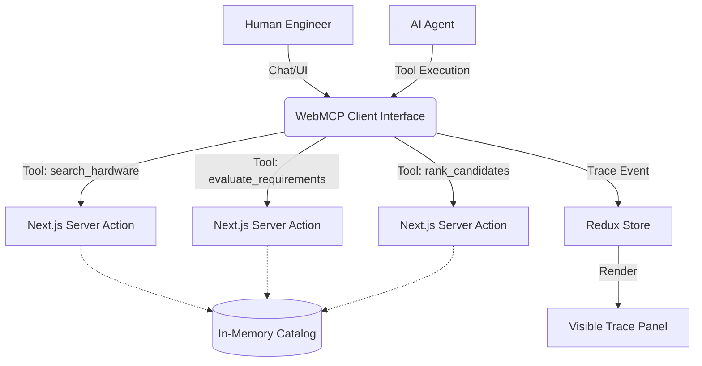

# HardwareScout (WebMCP Hackathon)

HardwareScout is a WebMCP-native engineering procurement workspace, transformed from the original Circuit Parts ecommerce platform.

## Concept

Instead of a traditional B2C ecommerce storefront, HardwareScout acts as a collaborative, agent-driven workspace for hardware engineers. An AI agent (connected via MCP) can autonomously search for single-board computers (SBCs), evaluate them against strict engineering requirements, compare candidates, rank them by human priorities (e.g. price vs lead time), and generate automated Request For Quotes (RFQs).

## WebMCP Architecture

To reduce latency and deployment complexity, HardwareScout runs a **Browser-Native WebMCP Architecture**.

Instead of a separate Node.js MCP server, the tools are embedded directly into the Next.js application using Server Actions.



## Running the Application

1. Install dependencies:
   ```bash
   npm install
   ```
2. Run the development server:
   ```bash
   npm run dev
   ```
3. Navigate to `http://localhost:3000/demo`.

## Running the Automated Demo

To demonstrate the full agent workflow without requiring a live LLM connection during the hackathon judging:

1. Go to the `/demo` page.
2. Click the **Run Automated Demo (Agent Simulation)** button.
3. Watch the Trace Panel at the bottom log the simulated agent tool calls (`search_hardware`, `evaluate_requirements`, etc.) and see the UI update dynamically via the Redux store.
